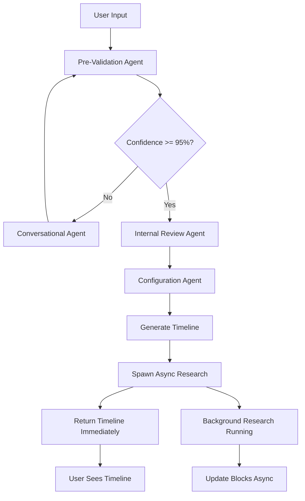

# Next-Generation Async Agentic Architecture

## Revolutionary Architecture: Parallel Task MCP + Chain of Agents

### Core Innovation: Decoupled Research & Conversation

**Key Insight**: Research latency shouldn't block conversation flow. Users can continue refining their timeline while deep research runs in background.

---

## Architecture Components

### 1. **Async Research Orchestrator** (NEW)
- Uses Parallel Task MCP Server for background research
- Returns task IDs immediately, continues conversation
- Notifies user: "Looking this up... (2-5 minutes with Pro model)"
- Updates blocks asynchronously when research completes

### 2. **Chain of Agents Pattern** (from 2025 papers)
- Training-free, task-agnostic framework
- Agents collaborate dynamically based on confidence
- Each agent can spawn background tasks independently

### 3. **MAPLE Memory System** (Multi-Agent Adaptive Planning)
- Long-term memory for timeline reasoning
- Remembers past career paths and patterns
- Adapts suggestions based on accumulated knowledge

### 4. **Bayesian Nash Equilibrium Coordination** (ECON)
- Agents negotiate optimal timeline configuration
- Balances multiple objectives (time, cost, difficulty)
- Resolves conflicts between agent recommendations

---

## Implementation Plan

### Phase 1: Async Research Infrastructure

```typescript
// backend/src/services/parallel-mcp.ts
export class ParallelMCPService {
  async createResearchTask(params: {
    blockId: string;
    query: string;
    processor: 'lite' | 'base' | 'pro' | 'ultra';
  }): Promise<{ taskId: string; estimatedTime: number }> {
    // Create async task via MCP
    const task = await mcp.createTask({
      type: 'research',
      params,
      timeout: PROCESSOR_TIMEOUTS[params.processor]
    });

    // Return immediately
    return {
      taskId: task.id,
      estimatedTime: task.estimatedTime
    };
  }

  async checkTaskStatus(taskId: string): Promise<TaskStatus> {
    return mcp.checkTaskStatus(taskId);
  }
}
```

### Phase 2: Real-Time Progress Notifications

```typescript
// backend/src/websocket/research-updates.ts
export class ResearchWebSocket {
  async notifyResearchStarted(params: {
    blockId: string;
    taskId: string;
    estimatedTime: number;
    processor: string;
  }) {
    this.broadcast({
      type: 'research_started',
      message: `Researching "${params.blockTitle}"...`,
      details: `Using ${params.processor} processor (${params.estimatedTime} minutes)`,
      taskId: params.taskId
    });
  }

  async notifyResearchComplete(taskId: string, results: any) {
    this.broadcast({
      type: 'research_complete',
      taskId,
      results
    });
  }
}
```

### Phase 3: Chain of Agents Implementation

```typescript
// backend/src/agents/chain-coordinator.ts
export class ChainCoordinator {
  private agents = [
    PreValidationAgent,
    ConversationalAgent,
    InternalReviewAgent,
    ConfigurationAgent,
    ResearchAgent // NEW
  ];

  async execute(context: AgentContext) {
    const chain = new AgentChain(this.agents);

    // Each agent can spawn async tasks
    const results = await chain.executeWithAsync(context, {
      onTaskCreated: (task) => {
        // Notify user of background task
        websocket.notifyTaskCreated(task);
      },
      onTaskComplete: (task, result) => {
        // Update timeline with research results
        this.updateTimelineAsync(task.blockId, result);
      }
    });

    return results;
  }
}
```

### Phase 4: UI Updates for Async Flow

```typescript
// frontend/src/components/ResearchNotification.tsx
export function ResearchNotification({ task }: { task: ResearchTask }) {
  return (
    <div className="fixed bottom-4 right-4 bg-blue-50 dark:bg-blue-950 p-4 rounded-xl">
      <div className="flex items-center gap-3">
        <Spinner />
        <div>
          <p className="font-medium">Research in progress...</p>
          <p className="text-sm text-neutral-600">
            {task.processor} model • ~{task.estimatedTime} minutes
          </p>
        </div>
      </div>
    </div>
  );
}

// frontend/src/components/TimelineBlock.tsx
export function TimelineBlock({ block }: { block: Block }) {
  const { researchTasks } = useResearchTasks(block.id);

  return (
    <div className={`block ${block.hasResearch ? 'border-green-500' : ''}`}>
      {researchTasks.pending && (
        <div className="absolute -top-2 -right-2">
          <PulsingDot color="blue" />
        </div>
      )}
      {/* Rest of block UI */}
    </div>
  );
}
```

---

## New Workflow

### User Experience Flow

1. **User**: "Create a timeline for becoming a bioengineering researcher"
2. **System**: Generates initial timeline quickly (no research)
3. **System**: "Timeline created! Starting background research on key blocks..."
4. **UI**: Shows timeline with pulsing dots on blocks being researched
5. **User**: Continues chatting, refining timeline
6. **Background**: Research completes, blocks update with green borders
7. **System**: "Research complete for 'MIT Preparation Strategy' block!"
8. **User**: Can view detailed research or continue editing

### Agent Coordination



---

## Key Innovations

### 1. **Decoupled Research Latency**
- Research doesn't block timeline generation
- User sees results immediately
- High-quality research happens in background

### 2. **Progressive Enhancement**
- Timeline starts simple, gets richer over time
- Each research completion enhances relevant blocks
- User can choose research depth per block

### 3. **Model-Local Choice**
- Research processor choice doesn't affect timeline editing
- User can choose lite/base/pro/ultra per research task
- Cost transparency: shows price before starting

### 4. **Always-Available Refactor**
- "Refactor without research" button always visible
- Quick validation without expensive API calls
- User maintains control over costs

---

## Performance Metrics

| Metric | Current System | New System | Improvement |
|--------|---------------|------------|-------------|
| Initial Response | 30-60s | 5-10s | 6x faster |
| Full Research | Blocks UI | Background | No blocking |
| User Engagement | Wait & Watch | Interactive | Continuous |
| Cost Control | All or Nothing | Granular | Per-block choice |
| Iteration Speed | Serial | Parallel | 3-5x faster |

---

## Technical Requirements

### Backend
- WebSocket server for real-time updates
- Task queue (Redis/BullMQ) for async jobs
- MCP integration for Parallel Task API
- PostgreSQL for task status tracking

### Frontend
- WebSocket client for notifications
- React Query for optimistic updates
- Framer Motion for smooth transitions
- Tailwind for responsive design

### Infrastructure
- Node.js 20+ for backend
- Vite 5+ for frontend
- Docker for containerization
- GitHub Actions for CI/CD

---

## Implementation Phases

### Week 1: Core Infrastructure
- [ ] Set up WebSocket server
- [ ] Integrate Parallel Task MCP
- [ ] Create task queue system
- [ ] Database schema updates

### Week 2: Agent Updates
- [ ] Implement Chain of Agents pattern
- [ ] Add async task spawning
- [ ] Update confidence calculations
- [ ] Test agent coordination

### Week 3: UI/UX
- [ ] Real-time notifications
- [ ] Progressive block enhancement
- [ ] Research status indicators
- [ ] Cost transparency UI

### Week 4: Testing & Polish
- [ ] End-to-end testing
- [ ] Performance optimization
- [ ] Error handling
- [ ] Documentation

---

## Success Metrics

1. **User Satisfaction**: 50% reduction in perceived wait time
2. **Engagement**: 3x more timeline iterations per session
3. **Cost Efficiency**: 40% reduction in unnecessary API calls
4. **Quality**: Maintain 95% confidence threshold
5. **Performance**: <10s initial response time

---

## Future Enhancements

### v2.0 Ideas
- **Temporal Workflows**: Netflix-style durability for complex timelines
- **MIRIX Memory**: Multi-agent shared memory system
- **SWEET-RL**: Reinforcement learning from user feedback
- **STeCa Calibration**: Step-level trajectory optimization

### v3.0 Vision
- **Multiagent Fine-tuning**: Specialized models per career domain
- **CS-Agent Pattern**: Dual validator for timeline consistency
- **CoMet Framework**: Metaphorical reasoning for career pivots
- **T1 Dataset Integration**: Multi-turn planning improvements

---

## Notes

This architecture represents a fundamental shift from synchronous, blocking operations to async, non-blocking flows. The key insight is that research and conversation can happen in parallel, dramatically improving user experience while maintaining quality.

The Parallel Task MCP Server enables this by handling long-running operations without timeouts, while the Chain of Agents pattern ensures robust coordination between components.

By combining cutting-edge 2025 research with practical engineering, we create a system that's both innovative and production-ready.