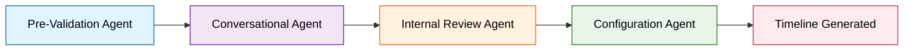

# Career Trajectory AI

<div align="center">
  
  
  
  
  
</div>

---

## AI Career Planning Platform with Async Architecture

Transform career confusion into a personalized, actionable roadmap. Built with enterprise-grade architecture, comprehensive testing, and full observability.

### Highlights

- **95% Confidence Architecture**: AI agents must reach 95%+ confidence before proceeding
- **Async Research + WebSocket**: Background research with real-time UI updates
- **Visual Feedback System**: Pulsing blue dots, green glow animations, toast notifications
- **Research Integration**: Deep research via Parallel AI (9 tiers: lite → ultra8x)
- **Full Observability**: LangSmith tracing for every AI operation
- **Modern UI/UX**: Beautiful dark mode, responsive design, smooth animations
- **Comprehensive Testing**: E2E testing suite with LangSmith monitoring
- **Real-time Chat**: Conversational timeline refinement with context retention

---

## Demo & Features

### Multi-Layer Timeline Generation
```
Layer 1: High-level phases (6-month to 10-year blocks)
Layer 2: Detailed milestones (monthly actions)
Layer 3: Granular tasks (subjective to user)
```

### Conversational Configuration
- Smart question generation based on context gaps
- Confidence-driven conversation flow
- Real-time validation and error correction
- PDF/document upload support (resumes, transcripts)
- Automatic text extraction and context integration
- Full conversation state persistence across page reloads

### Real-Time Research Updates
- WebSocket-powered live updates (ws://localhost:3001/ws)
- Pulsing blue dots on blocks being researched
- Green glow animation when research completes
- Toast notifications for research events
- Non-blocking UI - edit while research runs in background

### LLM Export Functionality
- One-click export to plain text format
- Perfect for ChatGPT, Claude, Grok, and other LLMs
- Includes all timeline data, research, and personal notes
- Self-contained format with usage instructions

### Subagent Research Delegation
- University program research
- Career path analysis
- Skills gap identification
- Timeline optimization
- Market trend analysis

---

## Architecture Overview

### Four-Agent System with Async Research



1. **Pre-Validation Agent** - Analyzes input completeness (95% confidence threshold)
2. **Conversational Clarification Agent** - Gathers missing details through smart questions
3. **Internal Review Agent** - Quality gate before expensive operations
4. **Configuration Agent** - Generates validated, constraint-checked timelines

### Core Principle
> Every agent must achieve **AT LEAST 95% confidence** before proceeding to the next stage.

### Research Sub-Agents *(Optional)*

```typescript
// 5 Specialized Research Sub-Agents
export const UniversityResearchAgent    // University program analysis
export const CareerPathResearchAgent    // Industry pathway research
export const SkillsGapAnalysisAgent     // Skill requirement mapping
export const TimelineOptimizationAgent  // Timeline efficiency analysis
export const QuickResearchAgent         // Fast fact-checking
```

---

## Quick Start

### Prerequisites
- Node.js 18+
- npm/yarn
- Anthropic API key
- *(Optional)* Parallel AI key for research features

### Installation

```bash
# Clone the repository
git clone https://github.com/vignankamarthi/Career-Trajectory
cd career-trajectory-ai

# Backend setup
cd backend
npm install
cp .env.example .env
# Add your API keys to .env
npm run dev  # Runs on http://localhost:3001

# Frontend setup (new terminal)
cd frontend
npm install
npm run dev  # Opens http://localhost:3000
```

### Environment Configuration

```bash
# backend/.env
ANTHROPIC_API_KEY=your_anthropic_key_here
PARALLEL_API_KEY=your_parallel_key_here  
LANGCHAIN_TRACING_V2=true                # Optional for observability
LANGCHAIN_API_KEY=your_langsmith_key     # Optional for observability
LANGCHAIN_PROJECT=career-trajectory      # Optional for observability
```

---
## LangSmith Observability (QA)

Monitor all AI operations in real-time:
- Agent decision traces
- Confidence score evolution
- Research query analytics
- Performance metrics
- Error tracking

---

## Technology Stack

### Frontend
- **React 18** - Modern hooks-based architecture
- **TypeScript** - Full type safety
- **Vite** - Lightning-fast dev experience
- **Tailwind CSS** - Utility-first styling with dark mode
- **React Query** - Smart data fetching & caching
- **Heroicons** - Beautiful SVG icons

### Backend
- **Express.js** - Robust API framework
- **TypeScript** - End-to-end type safety
- **SQLite** - Embedded database for timelines
- **LangChain** - AI agent orchestration
- **Zod** - Runtime validation schemas

### AI & Research
- **Anthropic Claude Sonnet 4** - Primary reasoning engine
- **LangSmith** - AI operation observability
- **Parallel AI** - Multi-tier research capabilities
- **Structured Outputs** - Reliable JSON generation

---

## Cost Structure

| Operation | Cost Range | Description |
|-----------|------------|-------------|
| Initial Timeline | $0.30 - $0.70 | Full 4-agent pipeline |
| Conversation Turn | $0.05 - $0.10 | Clarification questions |
| Timeline Edit | $0.10 - $0.30 | Chat-based refinements |
| Research Query | $0.005 - $2.40 | Depends on tier (lite → ultra8x) |

**Cost-Optimized Design:**
- Confidence thresholds prevent unnecessary operations
- Research is entirely optional
- Smart caching reduces redundant API calls

---

## Project Structure

```
Career-Trajectory/
├── backend/
│   ├── src/
│   │   ├── agents/                   # AI agent implementations (8 agents)
│   │   │   ├── chain-coordinator.ts        # Agent coordination (future feature)
│   │   │   ├── configuration-agent.ts      # Timeline generation with tool calling
│   │   │   ├── conversational-assistant.ts # Q&A agent with context
│   │   │   ├── conversational-clarification-agent.ts # Clarification questions
│   │   │   ├── internal-agent.ts           # Internal state review
│   │   │   ├── pre-validation-agent.ts     # Input validation (95% threshold)
│   │   │   ├── research-sub-agents.ts      # 5 specialized research agents
│   │   │   └── validation-agent.ts         # Timeline validation with confidence
│   │   ├── routes/                   # REST API endpoints (7 routes)
│   │   │   ├── analyze.ts                  # Timeline analysis endpoint
│   │   │   ├── blocks.ts                   # Block operations
│   │   │   ├── chat.ts                     # POST /api/chat - Conversational Q&A
│   │   │   ├── configure-with-context.ts   # POST /api/configure-with-context
│   │   │   ├── save.ts                     # PUT /api/save/:id, GET /api/timelines/:id
│   │   │   ├── test-research.ts            # Research testing endpoint
│   │   │   └── timelines.ts                # Timeline CRUD operations
│   │   ├── services/                 # External integrations
│   │   │   ├── anthropic.ts                # Claude API wrapper with tool calling
│   │   │   ├── parallel-mcp.ts             # Async research service (fire-and-forget)
│   │   │   ├── parallel.ts                 # Parallel AI integration
│   │   │   └── tracing.ts                  # LangSmith tracing service
│   │   ├── websocket/                # Real-time updates
│   │   │   └── research-websocket.ts       # WebSocket server
│   │   ├── database/                 # SQLite persistence
│   │   │   ├── schema.sql                  # Database schema
│   │   │   └── db.ts                       # Database connection
│   │   ├── utils/                    # Shared utilities
│   │   │   ├── logger.ts                   # LangSmith logging
│   │   │   ├── validation.ts               # Zod schemas
│   │   │   └── langsmith-tracer.ts         # Tracing wrapper
│   │   ├── types/                    # TypeScript definitions
│   │   │   └── agent-context.ts            # Core data structures
│   │   ├── mcp/                      # Model Context Protocol
│   │   │   └── langsmith-server.ts         # LangSmith MCP
│   │   └── server.ts                 # Express entry point
│   ├── dist/                         # Compiled production build
│   └── data/                         # SQLite database file
├── frontend/
│   ├── src/
│   │   ├── views/                    # Main views
│   │   │   └── TimelineView.tsx            # Timeline display & editing
│   │   ├── components/               # Reusable UI components (9 components)
│   │   │   ├── BlockEditor.tsx             # Block content editor
│   │   │   ├── ErrorModal.tsx              # Error display modal
│   │   │   ├── GenerateConfirmationModal.tsx # Timeline generation confirmation
│   │   │   ├── LayerView.tsx               # Layer container with drag-and-drop
│   │   │   ├── Navigation.tsx              # App navigation bar
│   │   │   ├── PricingModal.tsx            # Research pricing/tier selection
│   │   │   ├── ResearchNotification.tsx    # Research status toast notifications
│   │   │   ├── ThemeToggle.tsx             # Dark/light mode toggle
│   │   │   └── TimelineBlock.tsx           # Individual block with inline editing
│   │   ├── contexts/                 # React contexts
│   │   │   ├── ThemeContext.tsx            # Dark/light mode
│   │   │   └── ResearchTierContext.tsx     # Research tier selection
│   │   ├── hooks/                    # Custom React hooks
│   │   │   └── useWebSocket.ts             # WebSocket connection
│   │   ├── lib/                      # Utilities
│   │   │   └── api.ts                      # API client
│   │   ├── App.tsx                   # Frontend entry point
│   │   └── main.tsx                  # React mount point
│   ├── dist/                         # Production bundle
│   └── index.html                    # Vite entry point
├── CURRENT_AGENT_ARCHITECTURE.md     # Async architecture documentation
├── CITATIONS_AND_CREDITS.md          # Academic attribution and bibliography
├── QUICKSTART.md                     # User guide for end users
├── README.md                         # This file
├── .gitignore                        # Git ignore rules
├── .env.example                      # Environment variables template
├── package.json                      # Root package scripts (npm start)
└── LICENSE                           # MIT License
```

---

## API Reference

### Core Endpoints

```typescript
// 1. Initialize conversation
POST /api/configure-with-context/init
{
  "user_name": "John Doe",
  "start_age": 25,
  "end_age": 30,
  "end_goal": "Become a senior data scientist",
  "num_layers": 3
}

// 2. Clarification conversation
POST /api/configure-with-context/clarify
{
  "context_id": "uuid",
  "user_message": "I have a CS degree and 2 years experience"
}

// 3. Generate timeline
POST /api/configure-with-context/generate
{
  "context_id": "uuid"
}

// 4. Chat refinement
POST /api/chat/:timelineId
{
  "message": "Can you add more detail about technical skills?"
}

// 5. Export timeline for LLM use
GET /api/timelines/:id/export
// Returns: Plain text file download (.txt format)
```

### Research Endpoints

```typescript
// Block-level research
POST /api/blocks/:blockId/research
{
  "processor": "pro" // lite | base | pro | premium | ultra | ultra2x | ultra4x | ultra8x
}

// Validation
POST /api/validate
{
  // Timeline object for validation
}

// Save operations
POST /api/save/:timelineId/save-only     // No AI review
POST /api/save/:timelineId/lite-check    // Quick validation (~$0.005)
POST /api/save/:timelineId/refactor      // Deep analysis (~$0.15)
```

---

## Key Features Deep Dive

### Confidence-Driven Architecture
- Every agent calculates and reports confidence scores
- 95% threshold ensures quality before expensive operations
- Transparent decision-making with full audit trails

### Smart Research Integration
- 9 research processor tiers (lite to ultra8x)
- Specialized research agents for different domains
- Cost-aware research recommendations

### Conversational Refinement
- Context-aware chat system
- Timeline modifications through natural language
- Real-time validation and constraint checking

### Modern UI/UX
- Fully responsive design
- Beautiful dark mode support
- Smooth animations and transitions
- Accessibility-first approach
- Smart state persistence (survives page reloads)
- File upload with drag-and-drop support

### LLM Export System
- One-click plain text export functionality
- Optimized format for ChatGPT, Claude, Gemini, and other LLMs
- Includes complete timeline data with research results
- Self-contained with clear usage instructions
- Lightweight text format for easy sharing and analysis

### Enterprise-Grade Observability
- LangSmith integration for AI operation monitoring
- Structured logging throughout the application
- Performance metrics and error tracking
- Cost tracking and optimization insights

## License

This project is licensed under the MIT License - see the [LICENSE](LICENSE) file for details.


 **[CITATIONS_AND_CREDITS.md](./CITATIONS_AND_CREDITS.md)** - Academic integrity and source attribution

---